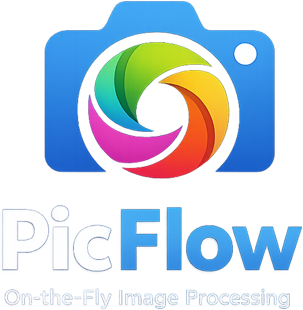

# PicFlow



High-performance image transformation server built with Bun, Sharp, and S3-compatible object storage.

Streams images directly from S3, applies transformations on-the-fly, and returns optimized formats like AVIF and WebP.

## Features

- Stream-based image processing
- S3-compatible storage support
- Automatic format negotiation
- AVIF / WebP / JPEG / PNG output
- Resize and fit modes
- Rotation and orientation handling
- Blur / dilate / erode filters
- Flip / flop transforms
- Negation filter
- Runtime validation with Zod
- Zero temp files

---

# Installation

```bash
bun install
```

---

# Environment Variables

Create a `.env` file:

```env
S3_ACCESS_KEY_ID=
S3_SECRET_ACCESS_KEY=
S3_ENDPOINT=
S3_BUCKET=
S3_REGION=
PORT=3000
```

## Example

```env
S3_ACCESS_KEY_ID=minioadmin
S3_SECRET_ACCESS_KEY=minioadmin
S3_ENDPOINT=http://localhost:9000
S3_BUCKET=images
S3_REGION=us-east-1
```

---

# Running

```bash
bun run index.ts
```

Server starts on:

```txt
http://localhost:3000
```

---

# URL Format

```txt
/:key?<options>
```

## Example

```txt
/images/cat.jpg?width=800&format=webp
```

---

# Supported Query Parameters

## Resize

| Parameter | Type | Description |
|---|---|---|
| width | number | Resize width |
| height | number | Resize height |
| fit | enum | Resize fit mode |

### Fit Options

- cover
- contain
- fill
- inside
- outside

---

## Format

| Parameter | Type | Description |
|---|---|---|
| format | enum | Force output format |

### Supported Formats

- jpeg
- png
- webp
- avif

If `format` is omitted, the server automatically chooses the best format based on the request `Accept` header.

Priority order:

1. AVIF
2. WebP
3. JPEG

---

## Rotation

| Parameter | Type | Description |
|---|---|---|
| rotate | number | Rotate image between -360 and 360 degrees |

### Example

```txt
?rotate=90
```

---

## Flip / Flop

| Parameter | Description |
|---|---|
| flip | Vertical flip |
| flop | Horizontal flip |

### Example

```txt
?flip=true
```

---

## Blur

| Parameter | Type | Description |
|---|---|---|
| blur | number | Gaussian blur value |

### Range

```txt
0.3 - 1000
```

---

## Morphology Filters

| Parameter | Type | Description |
|---|---|---|
| dilate | number | Dilate image |
| erode | number | Erode image |

---

## Negate

| Parameter | Description |
|---|---|
| negate | Invert image colors |

### Example

```txt
?negate=true
```

---

# Examples

## Resize

```txt
/images/photo.jpg?width=1200
```

## Resize + WebP

```txt
/images/photo.jpg?width=1200&format=webp
```

## Crop with Cover

```txt
/images/photo.jpg?width=500&height=500&fit=cover
```

## Rotate

```txt
/images/photo.jpg?rotate=90
```

## Blur

```txt
/images/photo.jpg?blur=5
```

## Flip

```txt
/images/photo.jpg?flip=true
```

## Negate

```txt
/images/photo.jpg?negate=true
```

---

# Validation

All query parameters are validated using Zod.

Invalid requests return:

```http
400 Bad Request
```

Example:

```txt
?rotate=9999
```

Response:

```txt
Too big: expected number to be <=360
```

---

# Caching

Responses include:

```http
Cache-Control: max-age=86400, s-maxage=860400
```

Designed for CDN caching.

---

# Architecture

Pipeline flow:

```txt
S3 Stream
  -> Sharp Transform
  -> PassThrough Stream
  -> HTTP Response
```

Images are never fully loaded into memory.

---

# Tech Stack

- Bun
- Sharp
- Zod
- S3-compatible object storage

---

# Notes

## Sharp Auto Orientation

All images automatically apply:

```ts
.autoOrient()
```

This respects EXIF orientation metadata from cameras and phones.

---

# TODO Ideas

- Quality controls
- Progressive JPEG
- Watermarking
- Metadata stripping
- Signed URLs
- Animated WebP/GIF support
- Smart cropping
- Background color support
- Presets
- Rate limiting

---

# License

O'Saasy License Agreement - Basically… the MIT do-whatever-you-want license, but with the commercial rights for SaaS reserved for the copyright holder.